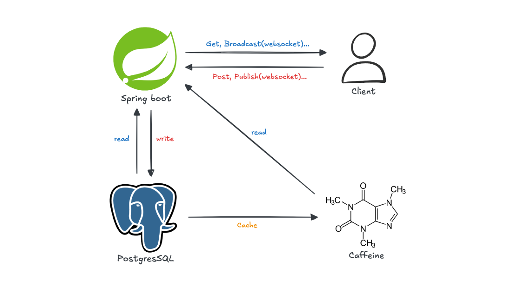

# api.madness

## 설명

Spring Boot 기반의 실시간 채팅 백엔드 서비스입니다  
JWT 인증·인가, STOMP/WebSocket 채팅서비스를 제공합니다

## 구조



## 주요 기능

- **JWT 인증·인가**  
  Access/Refresh 토큰으로 로그인·권한 관리
- **실시간 채팅**  
  STOMP(SockJS) 프로토콜 기반 메시지 송수신
- **채널 관리**  
  채널 생성·조회·참여자 집계

## 기술 스택

- **언어**: Java 17
- **프레임워크**: Spring Boot 3.4.2
- **라이브러리**:
  - Spring Security
  - Spring WebSocket (STOMP/SockJS)
  - Spring Data JPA
  - Caffeine
- **DB**: PostgreSQL (운영), H2 (개발)
- **빌드**: Gradle
- **테스트**: JUnit 5, Mockito
- **인프라**: Cloudtype, GitHub Actions (CI/CD), Supabase (PostgreSQL)

## 환경 변수

```bash
# Local (Development)
DEV_DB_URL=
DEV_DB_USERNAME=
DEV_DB_PASSWORD=
DEV_JWT_SECRET=
DEV_JWT_EXP_MS=
DEV_JWT_REFRESH_EXP_SEC=

# Production
SPRING_PROFILES_ACTIVE=prod
MD_JWT_EXP_MS=
MD_JWT_REFRESH_EXP_SEC=
MD_JWT_SECRET=
MD_PASSWORD=
MD_URL=
MD_USERNAME=
```

## 도메인

[https://api.madn.es](https://api.madn.es)

[Madness](https://madn.es)

## 문의

- Email: [nera4936@gmail.com](mailto:nera4936@gmail.com)
